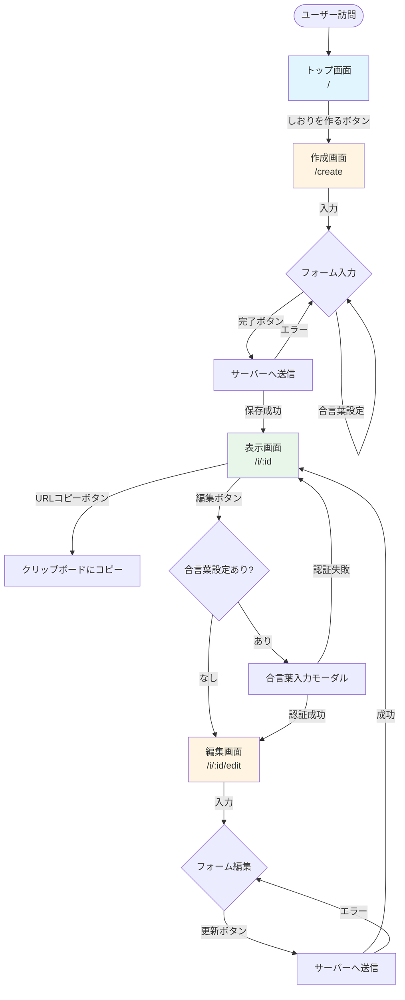

# 画面定義

## 画面遷移フロー

---

## 画面一覧

| 画面名 | パス | 説明 |
|--------|------|------|
| トップ画面 | `/` | サービス説明とLP |
| 作成画面 | `/create` | しおりを新規作成 |
| 表示画面 | `/i/[id]` | しおりを表示（閲覧専用） |
| 編集画面 | `/i/[id]/edit` | しおりを編集（合言葉認証あり） |

---

## 各画面の詳細

### 1. トップ画面（`/`）

**目的**: サービスの紹介と新規作成への導線

**表示要素**:
- サービス名・キャッチコピー
- サービス説明文
- 「しおりを作る」ボタン（CTA）
- サンプル画像（任意）

**アクション**:
- 「しおりを作る」ボタン → `/create` へ遷移

---

### 2. 作成画面（`/create`）

**目的**: しおりの新規作成

**入力セクション**:

#### タイトルセクション
- しおりのタイトル（テキスト入力、必須）

#### 概要セクション
- **[概要を追加]** ボタン → 新しい概要項目を追加
- 各概要項目:
  - タイトル（例: 旅費、持ち物）
  - 内容（テキストエリア）
  - 削除ボタン

#### 行程セクション
- **[行程を追加]** ボタン → 新しい行程を追加
- 各行程項目:
  - 日付（日付ピッカー）
  - 日数（任意、数値入力: 1日目、2日目など）
  - 時間（時刻ピッカー）
  - タイトル（場所名・イベント名）
  - 交通手段（選択式）
    - 徒歩 / 電車 / バス / 飛行機 / 車 / 船 / 自転車
  - 補足（テキストエリア、任意）
  - 削除ボタン

#### 合言葉セクション（任意）
- 合言葉（パスワード入力）
- 説明文: 「編集時に必要です。設定しない場合は誰でも編集可能になります」

#### アクション
- **[完了]** ボタン → サーバーへ送信 → `/i/[id]` へ遷移
- バリデーションエラー時はエラーメッセージ表示

---

### 3. 表示画面（`/i/[id]`）

**目的**: 作成したしおりを表示・共有

**表示要素**:

#### ヘッダー
- しおりのタイトル

#### 概要セクション
- タイトルと内容のリスト表示

#### 行程セクション（タイムライン形式）
- 日付・日数（1日目、2日目など）
- 時間
- 場所・イベント名
- 交通手段アイコン
- 補足情報

#### アクション
- **[URLをコピー]** ボタン → クリップボードにコピー
- **[編集]** ボタン → 合言葉入力モーダルまたは `/i/[id]/edit` へ遷移

**合言葉入力モーダル** (合言葉が設定されている場合):
- 合言葉入力フォーム
- [確認] ボタン
- [キャンセル] ボタン
- 認証成功 → `/i/[id]/edit` へ遷移
- 認証失敗 → エラーメッセージ表示

---

### 4. 編集画面（`/i/[id]/edit`）

**目的**: 既存のしおりを編集

**入力セクション**:
- 作成画面と同じUI
- 既存データがフォームに入力された状態で表示

**アクション**:
- **[更新]** ボタン → サーバーへ送信 → `/i/[id]` へ遷移
- **[キャンセル]** ボタン → `/i/[id]` へ戻る

---

## UI/UX方針

### モバイルファースト
- スマホ幅固定デザイン（max-width: 480px）
- タップしやすいボタンサイズ（最低44x44px）
- PC表示では中央配置

### タイムライン表示
- 縦方向レイアウト
- 時系列に沿った表示
- 交通手段アイコンを見やすく配置
- 視覚的に美しいデザイン

### 直感的な操作
- 項目の追加・削除が簡単
- リアルタイムプレビュー（検討中）
- エラーメッセージは分かりやすく

---

## 将来の拡張案

- プレビュー機能（作成画面でリアルタイムプレビュー）
- ヘッダー画像・アイコンのカスタマイズ
- カラーテーマ選択
- ドラッグ&ドロップでの並び替え（要検討）
